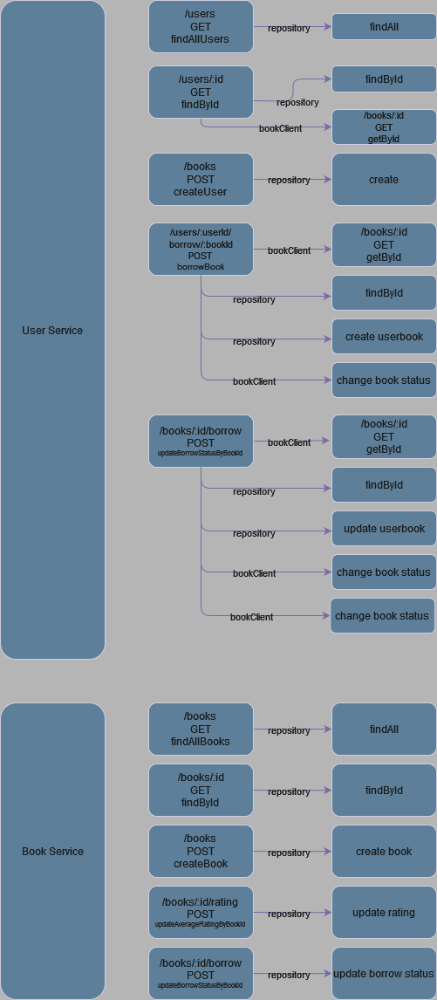

# Library Manager

The Library Manager is a compact application divided into two main services: `book-service` and `user-service`. Each service is responsible for different aspects of a library management system, allowing for scalable and maintainable development and deployment.

## Project Structure

The project is orchestrated as monorepo with two different microservices that communicate each other:
- **book-service**: Manages operations related to books.
- **user-service**: Manages user-related operations, besides has responsibility for borrowing and returning issues.

### Common Directory Structure

Both services follows a similar structure:
- `src`: Contains the source code files.
    - `clients`: For client communications.
    - `config`: Configuration files and their management.
    - `controllers`: Process welcomer.
    - `middlewares`: Handles middleware functions.
    - `models`: Definitions of data models and interfaces.
    - `repository`: Data access layer.
    - `routes`: API endpoints definer.
    - `services`: Business logic layer.
    - `app.ts`: Setts up the application.
    - `server.ts`: Starts the server and listens on a port.
- `node_modules`: Contains all npm dependencies.
- `.env`: Environment variables.
- `package.json` & `package-lock.json`: NPM configuration files.
- `tsconfig.json`: TypeScript compiler configuration.

#### Setup Instructions

1. Navigate to the service directory:
   ```bash
   cd book-service # or user-service
   npm install
   npm run dev

#### Project Domain Structure

